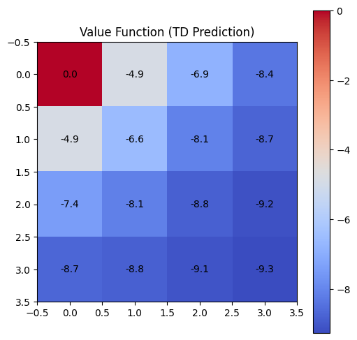
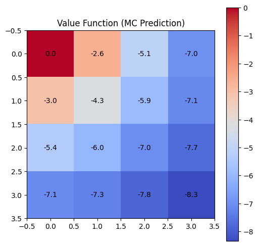
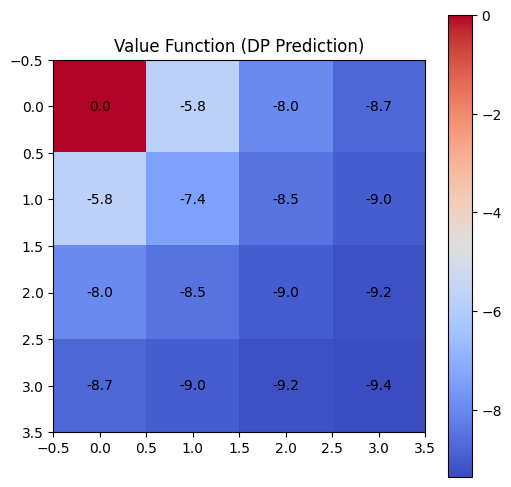
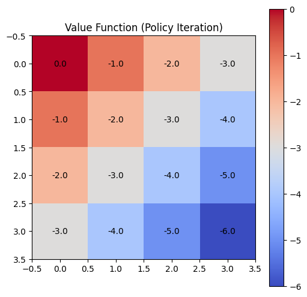

# Reinforcement Learning Case Study - Grid World

## Overview
This repository contains a case study on **Reinforcement Learning (RL)** using the **GridWorld problem**. The study implements and compares four different RL algorithms:

1. **Temporal Difference (TD) Prediction**
2. **Monte Carlo (MC) Prediction**
3. **Policy Iteration (MDP)**
4. **Value Iteration (VI)**

Each algorithm is implemented in a separate Jupyter Notebook with **visualizations, explanations, and results**.

---

##  Algorithms Implemented

### 1. Temporal Difference (TD) Prediction
TD Prediction is an **online learning method** that updates the value function after every step using the equation:

\[ V(s) \leftarrow V(s) + \alpha [R + \gamma V(s') - V(s)] \]

- **Learning Type:** Model-Free
- **Updates:** Per Step (Bootstrapping)
- **Advantage:** Faster learning without full episodes

#### **TD Prediction Output:**


---

### 2. Monte Carlo (MC) Prediction
MC Prediction estimates the value function based on **full-episode returns**:

\[ G_t = R_t + \gamma R_{t+1} + \gamma^2 R_{t+2} + \dots \]

- **Learning Type:** Model-Free
- **Updates:** At the end of each episode
- **Advantage:** Works well for episodic tasks

#### **MC Prediction Output:**


---

### 3. Policy Iteration (MDP)
Policy Iteration follows a **Dynamic Programming** approach:

- **Policy Evaluation:** Computes state values under a policy
- **Policy Improvement:** Updates the policy to maximize returns

\[ V(s) = \sum_a \pi(a|s) \sum_{s'} P(s' | s, a) [R + \gamma V(s')] \]

#### **Policy Iteration Output:**


---

### 4. Value Iteration (VI)
Value Iteration is an **optimized version of Policy Iteration**, updating values in a single loop:

\[ V(s) = \max_a \sum_{s'} P(s' | s, a) [R + \gamma V(s')] \]

- **Advantage:** Faster convergence by combining evaluation and improvement

#### **Value Iteration Output:**


---

## 🛠 Installation & Setup
### **1. Clone the Repository**
```sh
git clone https://github.com/Anirudh0314m/RL-Case-Study.git
cd RL-Case-Study
```

### **2. Install Dependencies**
```sh
pip install -r requirements.txt
```

### **3. Run Jupyter Notebook**
```sh
jupyter notebook
```
Open the desired notebook (`TD_Prediction.ipynb`, `MC_Prediction.ipynb`, etc.) and execute the cells.

---

##  Directory Structure
```
RL-Case-Study/
│── TD_Prediction_Algorithm.ipynb
│── MC_Prediction_Algorithm.ipynb
│── Policy_Iteration_Algorithm.ipynb
│── Value_Iteration_Algorithm.ipynb
│── output_images/
│   ├── td_prediction.png
│   ├── mc_prediction.png
│   ├── policy_iteration.png
│   ├── value_iteration.png
│── README.md
│── requirements.txt
```

---

